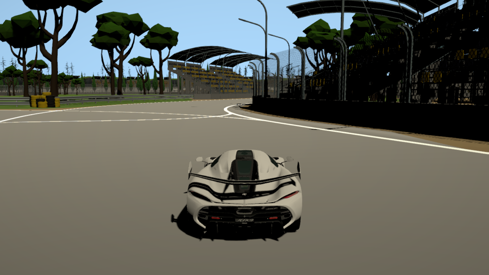

# SimpleCar2



A Unity/C# vehicle-physics sandbox by Simon Vutov, following the original
SimpleCar project. Suspension, tire forces, wheel rotation, and drivetrain logic
are computed in C# and applied to Unity rigidbodies; the controller does not use
Unity's `WheelCollider`.

- Raycast suspension with spring/damping forces and a configurable wheel layout.
- Longitudinal/lateral tire forces, traction limits, braking, and rolling resistance.
- RPM-dependent engine output, configurable gear ratios, automatic/manual shifting.
- Steering and traction assists, aerodynamic forces, and an experimental motorcycle mode.
- Chase/free cameras, wheel-slip and RPM telemetry, skid trails, and RPM-driven audio.
- Road, off-road, and F1 demo scenes, with an in-game scene selector.

This is an interactive physics/engineering project. Vehicle parameters are tuned
for the demos; the simulation is not calibrated against real vehicle measurements.
Imported vehicle models, environments, and sounds are separate from the custom
controller implementation.

## Run locally

1. Install **Unity 2022.3.29f1** through Unity Hub and activate your Unity license.
   The version is pinned in `ProjectSettings/ProjectVersion.txt`.
2. Clone the tested branch (assets are approximately 1.1 GB):

   ```sh
   git clone --depth 1 --branch codex/portfolio-polish https://github.com/SimonVutov/SimpleCar2.git
   ```

3. In Unity Hub, choose **Add project from disk**, select `SimpleCar2`, and open it
   with the pinned editor. Allow the first asset import and package restore to finish.
4. Open `Assets/Scenes/RoadF1.unity` and press **Play** for the F1 demo. `Road.unity`
   and `Offroad.unity` provide alternative vehicle/environment setups.
5. Press **Esc** to release the cursor and use the top-right scene/controls panel.

After the polish branch is merged into `main`, the clone command can omit
`--branch codex/portfolio-polish`. Keep **Active Input Handling = Both** in Player
Settings: driving uses the Input System, while camera/reset/shift shortcuts use
Unity's legacy input API. The checked-in project already has this setting.

The repository also contains source `.blend` and `.skp` assets. Blender is needed
if Unity reimports Blender sources; it is installed separately from Unity.

## Controls

| Action | Keyboard/mouse | Gamepad |
| --- | --- | --- |
| Accelerate / brake, then reverse | W / S | Right / left trigger |
| Steer | A / D | Left stick |
| Handbrake | Space | South button (A on Xbox) |
| Recover an overturned vehicle | R | — |
| Shift down / up | Q / E | — |
| Toggle free/chase camera | C | — |
| Look around in chase mode | — | Right stick |
| Move/look in free camera | Arrow keys / hold right mouse | — |
| Zoom | Mouse wheel | — |
| Release / recapture cursor | Esc / click outside the menu | — |

Automatic shifting is enabled in the demo engine settings. Disable
`Car > E > Automatic Transmission` in the Inspector to keep full manual control.
Select a vehicle's `Car` component to tune wheel positions, radius, mass,
suspension, torque, grip, gear ratios, and assists. A wheel prefab needs a visual
child transform. Optional audio slots may be left empty.

## Build and test

For a desktop build, use **File → Build Settings**, select your target platform,
and install its build-support module through Unity Hub. The checked-in build
list contains Road, Offroad, and RoadF1. Choose **Build and Run**; scene switching
is available in the player as well as the editor.

Run **Window → General → Test Runner**, then **Run All** in both EditMode and
PlayMode. Tests cover resistance in both directions, finite airborne slip,
reverse RPM, manual transmission, audio input sanitization, airborne wheel
behavior, missing scene scripts, active camera targets, and throttle-driven
movement in all three build scenes.

Command-line equivalents (macOS; adjust the editor path on other platforms):

```sh
UNITY_EDITOR="/Applications/Unity/Hub/Editor/2022.3.29f1/Unity.app/Contents/MacOS/Unity"
mkdir -p TestResults
"$UNITY_EDITOR" -batchmode -projectPath "$PWD" -runTests -testPlatform EditMode -testResults "$PWD/TestResults/editmode.xml" -logFile "$PWD/TestResults/editmode.log"
"$UNITY_EDITOR" -batchmode -projectPath "$PWD" -runTests -testPlatform PlayMode -testResults "$PWD/TestResults/playmode.xml" -logFile "$PWD/TestResults/playmode.log"
"$UNITY_EDITOR" -batchmode -quit -projectPath "$PWD" -executeMethod BuildDemo.BuildMac -logFile "$PWD/TestResults/build.log"
```

Close other editor instances using this project before batch runs. The macOS
build command writes `Builds/macOS/SimpleCar2.app`.

Validated locally with Unity 2022.3.29f1 on Apple Silicon: **9 EditMode tests and
2 PlayMode tests passed**. The PlayMode scene test exercises all three demos.
The macOS standalone build also completed successfully and was launched locally.

`python3 scripts/check_project.py` checks asset metadata/GUIDs, component filenames,
build-scene paths, and package versions without Unity. GitHub Actions runs these
repository checks; it does **not** run the licensed Unity runtime tests.

## Code

- `Assets/Scripts/Car.cs`: engine/transmission, wheel state, suspension and forces.
- `Assets/Scripts/WheelDynamics.cs`: resistance and slip calculations.
- `Assets/Scripts/CameraController.cs`: chase/free camera and cursor handling.
- `Assets/Scripts/CarAudioController.cs`: engine crossfade and driving sounds.
- `Assets/Scripts/VisualWheelUI.cs`: wheel-slip, speed, gear, and RPM display.
- `Assets/Scripts/DemoControls.cs`: player scene selector and controls panel.
- `Assets/Tests/`: EditMode and PlayMode regression tests.

Third-party assets retain their own terms. Included font/emoji notices remain in
`Assets/TextMesh Pro`; the repository does not grant a blanket license to the
imported car models, tracks, or audio.
